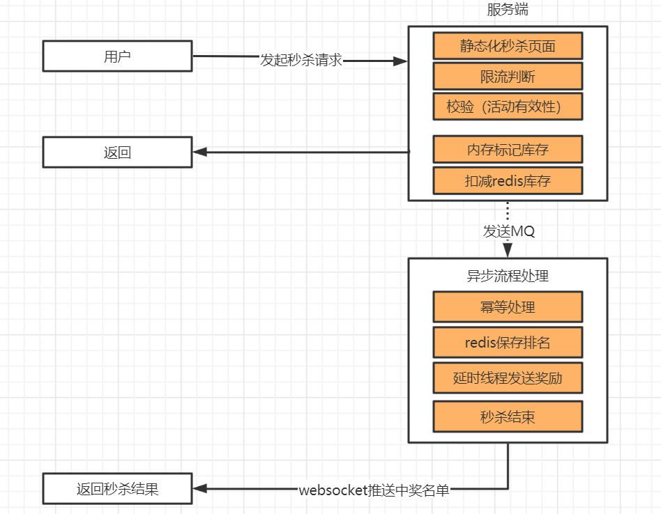

### 高并发秒杀系统：SpringBoot+Mybatis+Redis+RocketMq 

感谢这位博主（基于上面进行优化）：https://github.com/hfbin/Seckill   

---

---
### 项目启动说明
> 1、启动前，进行相关redis、mysql、rocketMq地址   
2、登录地址：http://localhost:8888/page/login      
3、商品秒杀列表地址：http://localhost:8888/goods/list   
4、账号：18077200000，密码：123456   
   
---

### 模拟高并发
1、数据库共有一千个用户左右（手机号：从18077200000~18077200998 密码为：123456），为压测准备的。
2、使用CyclicBarrier模拟高并发，1000个用户秒杀某个商品  
3、读：Redis
4、写：RocketMq

---
### 技术实现
1、页面缓存、商品详情静态化、订单静态化    
2、消息队列RocketMq进行流量肖峰     
4、接口限流防刷   
5、解决超卖问题   

---
### 页面截图
登录页

商品列表情页

商品详情页

订单详情页

---
